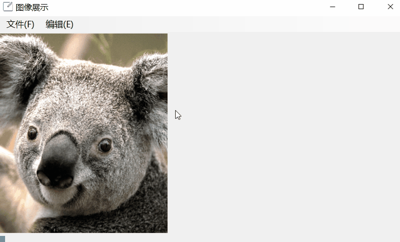

English | [中文](./README.md)

# Image Show

Image show and processing tool.

## Environment

- System: Windows 10
- Application: Visual Studio 2017
- Code: C#

## Install

Copy this in own computer, using `Visual Studio` open `ImageShow.sln`.

## Show

A test image is provided in the project `ExamplePicture.png` For testing function. A presentation animation is also provided `ExampleShow.gif`?

## License

MIT

## Reference

- [wchstrife.ImageProcessing](https://github.com/wchstrife/ImageProcessing)
